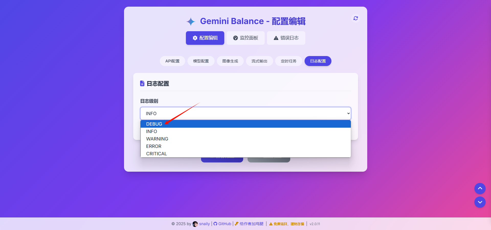
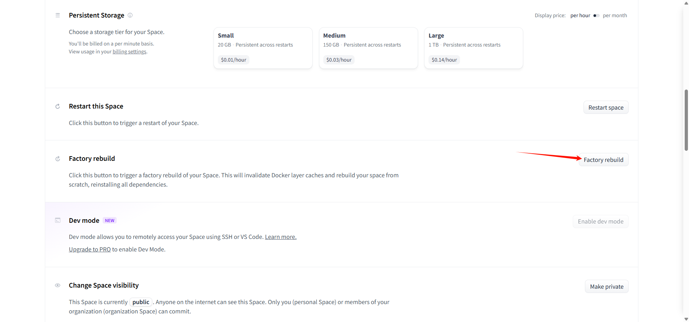

# 常见问题 ❓

::: tip 💡 如果下面问题都不是，请提供更多信息以便我们更好地帮助您：
请详细描述您遇到的问题，并**务必**贴出相关的报错日志（尤其是huggingface的日志）。
:::

## 1. 为什么输入了正确的AUTH_TOKEN，还是会跳转到登录页？ 🤔

不要在huggingface的内嵌页面输入AUTH_TOKEN，正确做法是先拷贝出嵌入页面的url，在浏览器上访问，再输入AUTH_TOKEN就可以进入到管理页了。

## 2. 为什么我是在浏览器访问的url，输入了auth_token还是进不到管理页？ 🔒

因为实际的AUTH_TOKEN在项目初始化的时候，就已经保存到数据库中，后面修改环境变量，不会生效，所以建议在项目初始化之前就要设置好AUTH_TOKEN。

两种方法进入后台：

- 可以通过以下几个值尝试进入后台，ALLOWED_TOKENS列表的第一个值或`your_token_1`,进入后台后再修改成自己想要设置的值，最后一定要保存配置，才会生效。
- 用数据库客户端工具（比如navicat）连接到数据库，参看t_settings表中AUTH_TOKEN的值，用该值进入后台。

## 3. 为什么我的画图用不了？ 🎨

检查一下图床是否已经配置，如果配置了，检查一下UPLOAD_PROVIDER是否和你的key匹配。

## 4. 为什么我修改了配置不生效？ 🔄

修改配置之后一定需要保存才会生效。

## 5. 之前在huggingface还是好好的，更新之后一直building 怎么办？ 🏗️

可能是触发了huggingface风控了，建议重新复制空间，然后修改space的名字，尽量不要和其他人相同。
备用方案就是换其他平台，比如render或者claw cloud。

## 6. 不想使用huggingface的ip，有什么办法吗？ 🌐

BASE_URL可以设置成代理地址：比如可以自建gemini代理，以deno为例：BASE_URL=`https://你的deno代理地址/v1beta`
这里提供一个deno版本的代码，你也可以通过cloudflare worker搭建，或者使用cloudflare ai gateway。也可用bbb搭建好的代理`https://api-proxy.me/gemini/v1beta`

```js
// proxy_server.ts
import { serve } from "https://deno.land/std/http/server.ts";

/**
 * 目标 API 服务器的 URL
 * 所有传入的请求将被转发到这个地址
 */
const TARGET_URL = "https://generativelanguage.googleapis.com";

/**
 * 处理代理请求的核心函数
 * @param req - 传入的 HTTP 请求对象
 * @returns 返回从目标服务器获取的响应或错误响应
 */
async function handler(req: Request): Promise<Response> {
  try {
    // 1. 解析原始请求的 URL，获取路径和查询参数
    const url = new URL(req.url);
    const path = url.pathname + url.search; // e.g., "/v1beta/models?key=..."

    // 2. 构建要请求的目标 URL
    const targetUrl = `${TARGET_URL}${path}`;

    console.log(`[代理请求] ${req.method} ${targetUrl}`);

    // 3. 复制原始请求的 Headers
    //    注意：Host 头通常不需要手动设置，fetch 会自动处理
    //    如果目标服务器需要特定的 Host 头，可以在这里修改
    const headers = new Headers(req.headers);

    // 4. 创建一个新的 Request 对象用于转发
    const proxyRequest = new Request(targetUrl, {
      method: req.method,
      headers: headers,
      // 如果原始请求有 body，克隆它并传递给代理请求
      // 注意：req.body 只能被读取一次，所以需要 clone()
      body: req.body ? req.clone().body : undefined,
      // 允许 fetch 自动处理重定向
      redirect: "follow",
    });

    // 5. 使用 fetch API 将请求发送到目标服务器
    const response = await fetch(proxyRequest);

    // 6. 构建返回给客户端的响应
    //    直接将目标服务器的响应体、状态码、状态文本和头信息传递过来
    const proxyResponse = new Response(response.body, {
      status: response.status,
      statusText: response.statusText,
      headers: response.headers, // 复制目标服务器的响应头
    });

    // 7. 添加 CORS (跨源资源共享) 头部，允许前端 JavaScript 调用
    //    这对于在浏览器中直接调用此代理很有用
    //    注意：目标服务器可能已经设置了部分 CORS 头，这里会覆盖或添加
    proxyResponse.headers.set("Access-Control-Allow-Origin", "*"); // 允许任何来源
    proxyResponse.headers.set("Access-Control-Allow-Methods", "GET, POST, PUT, DELETE, OPTIONS"); // 允许的方法
    proxyResponse.headers.set("Access-Control-Allow-Headers", "Content-Type, Authorization"); // 允许的请求头

    console.log(`[代理响应] ${response.status} ${response.statusText} for ${req.method} ${targetUrl}`);

    return proxyResponse;

  } catch (error) {
    // 8. 如果在代理过程中发生错误，记录错误并返回 500 响应
    console.error("代理请求出错:", error);
    return new Response(`代理错误: ${error.message}`, { status: 500 });
  }
}

/**
 * 处理 CORS 预检请求 (OPTIONS 方法)
 * 浏览器在发送可能产生副作用的跨域请求（如 POST, PUT, DELETE 或带有自定义头的 GET）前，
 * 会先发送一个 OPTIONS 请求来询问服务器是否允许该实际请求。
 * @param req - 传入的 HTTP 请求对象
 * @returns 如果是 OPTIONS 请求，返回带有 CORS 允许头部的 204 响应；否则返回 null。
 */
function handleCORS(req: Request): Response | null {
  if (req.method === "OPTIONS") {
    console.log(`[CORS 预检] ${req.url}`);
    return new Response(null, { // 对于 OPTIONS 请求，响应体通常为 null
      status: 204, // "No Content" 状态码
      headers: {
        "Access-Control-Allow-Origin": "*", // 必须与实际请求的响应头一致
        "Access-Control-Allow-Methods": "GET, POST, PUT, DELETE, OPTIONS", // 允许的方法
        "Access-Control-Allow-Headers": "Content-Type, Authorization", // 允许的请求头
        "Access-Control-Max-Age": "86400", // 预检请求结果的缓存时间 (秒)，例如 24 小时
      },
    });
  }
  // 如果不是 OPTIONS 请求，则返回 null，让主处理函数继续处理
  return null;
}

/**
 * 请求的主入口处理函数
 * 先检查是否为 CORS 预检请求，如果是则处理；否则交给核心代理函数处理。
 * @param req - 传入的 HTTP 请求对象
 * @returns 返回最终的 HTTP 响应
 */
async function handleRequest(req: Request): Promise<Response> {
  // 1. 处理 CORS 预检请求
  const corsResponse = handleCORS(req);
  if (corsResponse) {
    return corsResponse; // 如果是预检请求，直接返回处理结果
  }

  // 2. 处理正常的代理请求
  return await handler(req);
}

/**
 * 获取本机在局域网中的 IPv4 地址列表
 * @returns 返回一个包含本机有效 IPv4 地址的字符串数组
 */
function getLocalIPs(): string[] {
  const ips: string[] = [];
  try {
    const interfaces = Deno.networkInterfaces(); // 获取所有网络接口信息
    for (const iface of interfaces) {
      // 筛选条件:
      // - 非内部接口 (排除 loopback 如 127.0.0.1)
      // - 有地址
      // - 地址族是 IPv4
      // - 不是 APIPA 地址 (169.254.x.x)
      if (
        !iface.internal &&
        iface.address &&
        iface.family === "IPv4" &&
        !iface.address.startsWith("169.254.")
      ) {
        ips.push(iface.address);
      }
      // 你可以根据需要添加 IPv6 (iface.family === "IPv6")
    }
  } catch (error) {
    // 如果获取接口信息失败，打印错误，但程序继续运行
    console.error("⚠️ 无法获取网络接口信息:", error.message);
  }
  return ips;
}

// --- 🚀 服务器启动 ---

// 1. 获取端口号，优先从环境变量 PORT 获取，否则默认为 8080
const port = parseInt(Deno.env.get("PORT") || "8080");

// 2. 打印启动信息
console.log("--------------------------------------");
console.log(`🎯 代理目标: ${TARGET_URL}`);
console.log(`🚀 Deno 代理服务器正在启动...`);
console.log(`👂 监听端口: ${port}`);
console.log("--------------------------------------");
console.log("   🔗 可访问地址:");
console.log(`      - 本地访问: http://localhost:${port}/`);
console.log(`      - 回环地址: http://127.0.0.1:${port}/`);

// 3. 获取并打印局域网 IP 地址
const localIPs = getLocalIPs();
if (localIPs.length > 0) {
  console.log("      - 网络访问 (其他设备可能使用):");
  localIPs.forEach(ip => {
    console.log(`        - http://${ip}:${port}/`);
  });
  console.log("        (请确保防火墙允许 TCP 端口 " + port + " 的入站连接)");
} else {
  console.warn("      ⚠️ 未能自动检测到有效的本地网络 IP 地址。");
  console.warn("         如果需要从其他设备访问，请手动查询本机 IP 并确保防火墙设置正确。");
}
console.log("--------------------------------------");
console.log("⏳ 等待请求...");

// 4. 启动 HTTP 服务器，使用 handleRequest 函数处理所有请求
serve(handleRequest, { port });
```

[Ge0metry](https://linux.do/u/ge0metry)佬提供了cloudflare worker版本的代码，感谢佬

```js
/**
 * 目标 API 服务器的 URL
 * 所有传入的请求将被转发到这个地址
 * 您也可以考虑将其配置为 Worker 的环境变量 (Secret or Plain Text) 以增加灵活性
 * 例如: const TARGET_URL = env.TARGET_API_URL;
 */
const TARGET_URL = "https://generativelanguage.googleapis.com";

export default {
  /**
   * Cloudflare Worker 的主入口函数
   * @param request - 传入的 HTTP 请求对象
   * @param env - Worker 的环境变量 (如果配置了)
   * @param ctx - 执行上下文
   * @returns 返回从目标服务器获取的响应或错误响应
   */
  async fetch(request, env, ctx) { // Removed type annotations

    // 1. 处理 CORS 预检请求 (OPTIONS 方法)
    const corsResponse = handleCORS(request);
    if (corsResponse) {
      return corsResponse; // 如果是预检请求，直接返回处理结果
    }

    // 2. 处理实际的代理请求
    try {
      // 2.1 解析原始请求的 URL，获取路径和查询参数
      const url = new URL(request.url);
      const path = url.pathname + url.search; // e.g., "/v1beta/models?key=..."

      // 2.2 构建要请求的目标 URL
      const targetUrl = `${TARGET_URL}${path}`;

      console.log(`[Worker Proxy Request] ${request.method} ${targetUrl}`);

      // 2.3 复制原始请求的 Headers
      //     移除 Cloudflare 添加的特定头部信息，避免发送给源站
      const headers = new Headers(request.headers);
      headers.delete('cf-connecting-ip');
      headers.delete('cf-ipcountry');
      headers.delete('cf-ray');
      headers.delete('cf-visitor');
      // headers.set('Host', new URL(TARGET_URL).hostname); // Optional: uncomment if needed

      // 2.4 创建一个新的 Request 对象用于转发
      const proxyRequest = new Request(targetUrl, {
        method: request.method,
        headers: headers,
        body: request.body ? request.clone().body : undefined,
        redirect: "follow",
      });

      // 2.5 使用 fetch API 将请求发送到目标服务器
      const response = await fetch(proxyRequest);

      // 2.6 构建返回给客户端的响应
      const responseHeaders = new Headers(response.headers);

      // 2.7 添加 CORS (跨源资源共享) 头部
      responseHeaders.set("Access-Control-Allow-Origin", "*");
      responseHeaders.set("Access-Control-Allow-Methods", "GET, POST, PUT, DELETE, OPTIONS");
      responseHeaders.set("Access-Control-Allow-Headers", "Content-Type, Authorization");

      // 2.8 创建最终的响应对象
      const proxyResponse = new Response(response.body, {
        status: response.status,
        statusText: response.statusText,
        headers: responseHeaders,
      });

      console.log(`[Worker Proxy Response] ${response.status} ${response.statusText} for ${request.method} ${targetUrl}`);

      return proxyResponse;

    } catch (error) { // Removed type annotation for error
      // 3. 如果在代理过程中发生错误，记录错误并返回 500 响应
      console.error("Worker Proxy Error:", error);
      // Ensure error message is properly handled even if error is not an Error object
      const errorMessage = error instanceof Error ? error.message : String(error);
      return new Response(`代理错误: ${errorMessage}`, { status: 500 });
    }
  }
};

/**
 * 处理 CORS 预检请求 (OPTIONS 方法)
 * @param request - 传入的 HTTP 请求对象
 * @returns 如果是 OPTIONS 请求，返回带有 CORS 允许头部的 204 响应；否则返回 null。
 */
function handleCORS(request) { // Removed type annotation
  if (request.method === "OPTIONS") {
    console.log(`[Worker CORS Preflight] ${request.url}`);
    const headers = {
      "Access-Control-Allow-Origin": "*",
      "Access-Control-Allow-Methods": "GET, POST, PUT, DELETE, OPTIONS",
      "Access-Control-Allow-Headers": "Content-Type, Authorization",
      "Access-Control-Max-Age": "86400",
    };
    return new Response(null, {
      status: 204,
      headers: headers,
    });
  }
  return null; // Removed return type annotation
}
```

再到web端里把API基础URL改了 `https://xxxxx.xxxxx.workers.dev/v1beta`


## 7. 重新部署是不是可以把那些多余的配置删掉了？ ✅

是的，可以删掉，配置数据已经保存到数据库了，重新部署，会从数据库读取配置。只需留下数据库的配置、AUTH_TOKEN（进入后台用）和TZ（时区方便看日志）

## 8. 为什么我在huggingface上修改环境变量不生效？ ❌

自从引入了在线修改配置面板功能，用户可以不再需要从huggingface来修改配置，而是在web端去修改配置。huggingface上的环境变量只有在第一次项目初始化的时候用到，项目启动时会将配置全部同步到数据库。配置优先级 数据库 > huggingface环境变量

## 9. 为什么我访问页面是404？ 🚫

将space从private修改成public。

## 10. 怎么看更详细的日志？ 📄

将日志等级改成DEBUG，再保存配置。


## 11. 为什么画图有时候不显示？ 🤔

有可能是触发了谷歌的审核。

## 12. 做数学题时，时间太长导致没有输出内容？ ⏳

修改TIME_OUT配置，尽量拉长超时时间。

## 13. gemini-2.5-pro为什么会截断？ ✂️

免费key gemini-2.5-pro 不稳定，就是会有截断的问题，据elfmaid 佬测试，用官方的openai接口可以减少这种情况，后续打算维护这套接口。

## 14. 如何升级服务？

点击settings -> factory rebuild 即可


## 15. 绘图功能是只有付费 api 才有的吗？

`imagen-3.0-generate-002` 该绘图模型是需要付费api才能用，普通api可以用`gemini-2.0-flash-image-generations`或`gemini-2.0-flash-image`在对话中生图和修图

## 16. 为什么升级后一些按钮点击没有效果？

js缓存导致，建议通过ctrl + f5清空缓存

## 17. 为什么我检测了key，报了403错误，却没有归为失效key?

因为gemini的key不稳定，经常会报错，无法区分是真的失效还是假的失效。比如失效key会一直429，但是正常的key在请求超过限额也会报429，就不能把它归为失效key。所以我的设计是以失败多少次（该值可以配置），才算是失效的。失效key这也是参考，具体还是需要自己测试，所以失效秘钥列表也会有检测的按钮，就是用来检测没有失效的key

## 18. 我画图怎么不行了？调用的是gemini-2.0-flash-exp-image啊，日志显示这个错误

```plaintext
API call failed with status code 400, {
“error”: {
“code”: 400,
“message”: “Code execution is not enabled for models/gemini-2.0-flash-exp”,
“status”: “INVALID_ARGUMENT”
    }
}
```

把code execution关了

## 19. gemini balance 可以关闭思考吗 thinkingConfig (“thinkingBudget":0} ，CS里是这么设置吗

自带关闭，模型设置那里有思考模型列表把2.5flash加进去，会有一个nonthinking的模型，是不带思考的

## 20. error parsing value for field “API_KEYS” from source “EnvSettingsSource”

API_KEYS格式配置错了，一定是列表形式，比如：`["AIxxxxxxxxx"]`,包括中括号和双引号

## 21. 失败和无效密钥是怎么判定的，我以为失败就会被判定成无效

无效不是真无效，只是遇到一定次数的报错，可能遇到限额什么的了，未来可能能继续使用的
