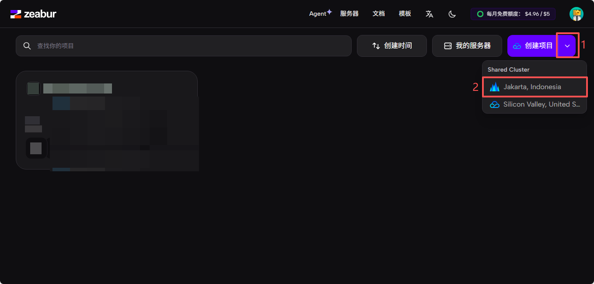
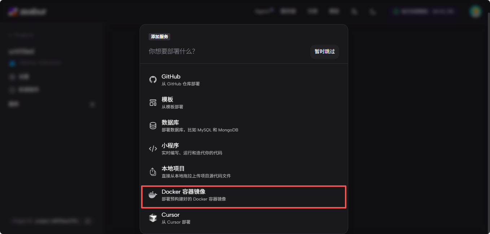
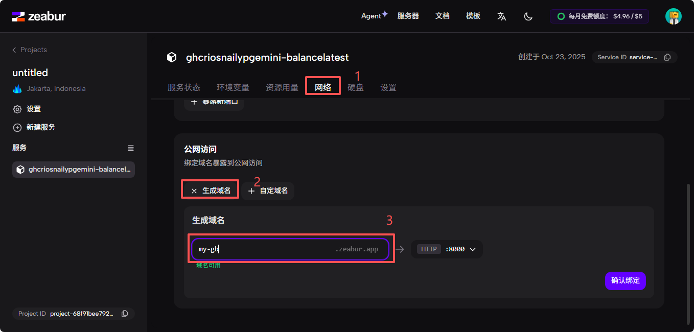

# 使用Zeabur部署Gemini Balance

此教程由[TheOninesixY](https://github.com/TheOninesixY)佬分享，感谢佬的无私分享

> Zeabur提供每月5美元的余额，且不需要注册超180天的GitHub账号，并且在国内访问也更快。部署步骤和Claw的差不多

## 获取 APIKEY

从[Google AI Studio](https://aistudio.google.com)获取APIKEY（需要科学上网环境）

## 1. 注册账号

点击[此链接](https://zeabur.com/login)前往Zeabur登录页
任选一个登陆方式

## 2. 部署项目

### 创建项目
- 在账号注册好后，应该会进入[Projects](https://dash.zeabur.com/projects)页面，在这个页面，点击创建项目右边的向下箭头，然后点击`Jakarta, Indonesia`


### 部署项目
- 在新进入的这个页面，选择`Docker容器镜像`


- 在下一个页面，这样填写：

    >镜像：
    >```text
    >ghcr.io/snailyp/gemini-balance:latest
    >```

    >环境变量：
    >```text
    >API_KEYS=[""]
    >ALLOWED_TOKENS=["",""]
    >AUTH_TOKEN=
    >MYSQL_HOST=
    >MYSQL_PORT=
    >MYSQL_USER=
    >MYSQL_PASSWORD=
    >MYSQL_DATABASE=
    >TZ=Asia/Shanghai
    >```
    >>变量说明：
    >>|变量名|说明|格式及示例|
    >>|---|---|---|
    >>|`API_KEYS`|Gemini API 密钥列表，用于负载均衡|`["your-gemini-api-key-1","your-gemini-api-key-2"]`|
    >>|`ALLOWED_TOKENS`|允许访问的 Token 列表|`["your-access-token-1","your-access-token-2"]`|
    >>|`AUTH_TOKEN`|【可选】超级管理员token，具有所有权限，不填默认使用 ALLOWED_TOKENS 的第一个|`sk-123456`|
    >>- 5 个"MYSQL"开头的变量为数据库配置，请参照部署文档有关数据库篇目获取。
    >>- TZ=Asia/Shanghai 用来控制时区方便看日志信息。
    >>- 最简完整示例如下：
    >>```text
    >>API_KEYS=["your-gemini-api-key-1","your-gemini-api-key-2"]
    >>ALLOWED_TOKENS=["your-access-token-1","your-access-token-2"]
    >>MYSQL_HOST=修改
    >>MYSQL_PORT=修改
    >>MYSQL_USER=修改
    >>MYSQL_PASSWORD=修改
    >>MYSQL_DATABASE=修改
    >>TZ=Asia/Shanghai
    >>```
    >>>注意：
    >>>- API_KEYS 和 ALLOWED_TOKENS 的值可以先不修改，待进入监控面板后再更正。（若按图中配置，则进入监控页面的密码为your-access-token-1）
    >>>- 5 个 MYSQL 数据库变量值必须填写，否则导致部署失败。

    >端口：`8000` 类型：`HTTP`

- 填写完成后，点击“部署”

- 这时，根据图中来配置域名
